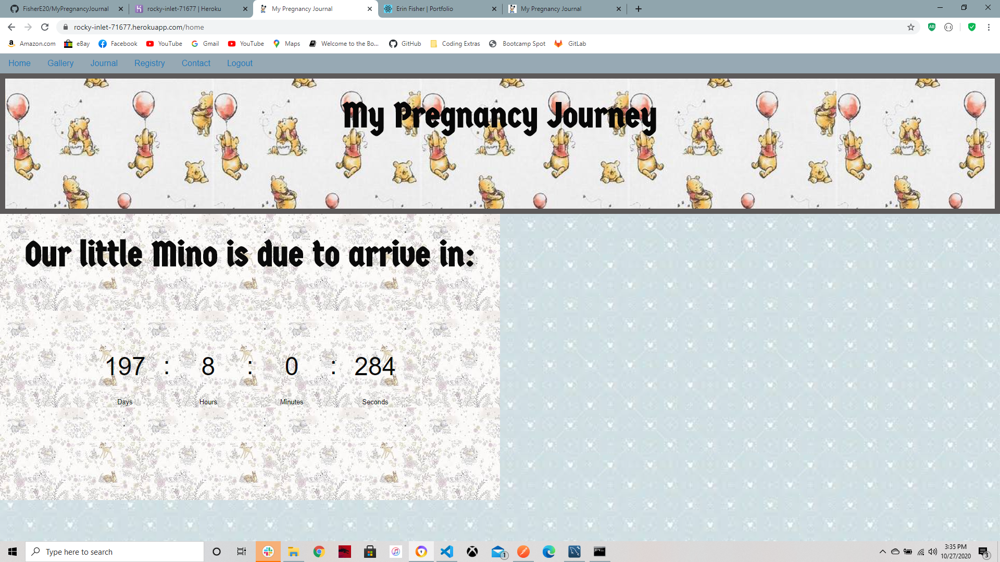

# My Pregnancy Journal



>Start postive test to delivery day

---

### Table of Contents

* [Description](#description)
* [How To Use](#how-to-use)
* [References](#references)
* [License](#license)
* [Author Info](#author-info)

---

## Description
This app was designed with the Mommys-to-be in mind. Allow her to design a website that family and friends can follow along with pregnancy and check out her baby registry(s).

#### Technologies

- React
- MYSQL
- Foundations-css
- Mailgun

---

## How To Use

#### Installation
Start by installing front and backend dependencies. While in this directory, run the following command:

```
npm install
```

This should install node modules within the server and the client folder.

After both installations complete, run the following command in your terminal:

```
npm start
```

Your app should now be running on <http://localhost:3000>. The Express server should intercept any AJAX requests from the client.


#### API Reference
- Mailgun


[Back To The Top](#My Pregnancy Journal)

---

## References
- Heroku - [My Pregnancy Journal](https://rocky-inlet-71677.herokuapp.com/)

[Back To The Top](#My Pregnancy Journal)

---

## License


Copyright(c) [2020] [Erin K Fisher]

[Back To The Top](#My Pregnancy Journal)

---

## Author Info

- GitHub - [F1sherE20](https://github.com/FisherE20/MyPregnancyJournal)
- Website - [FisherE20](https://intense-lowlands-19422.herokuapp.com/) 

[Back To The Top](#My Pregnancy Journal)
